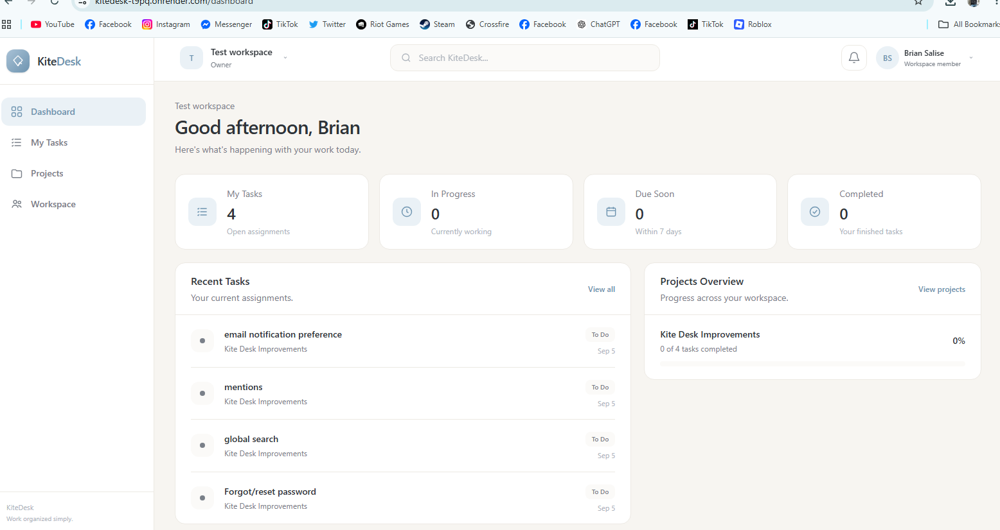
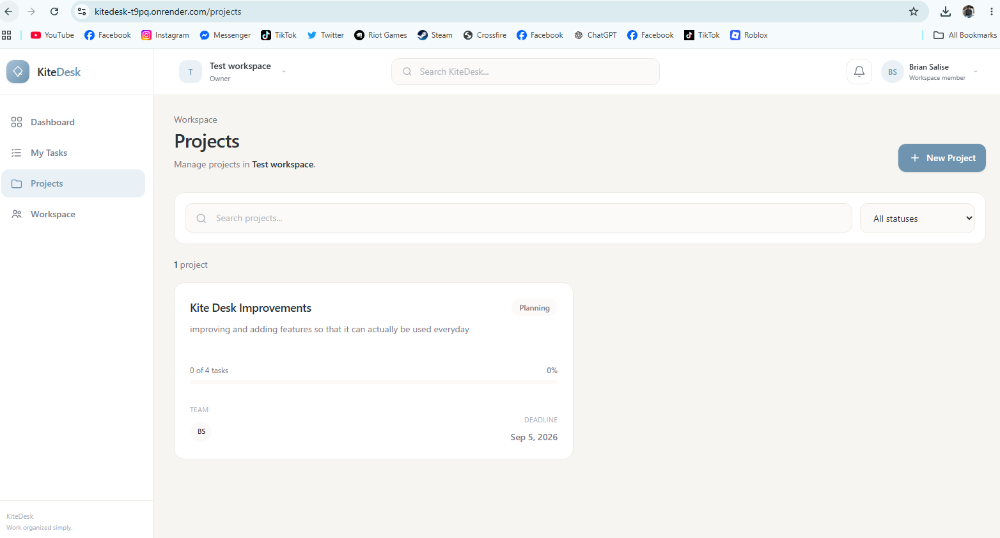
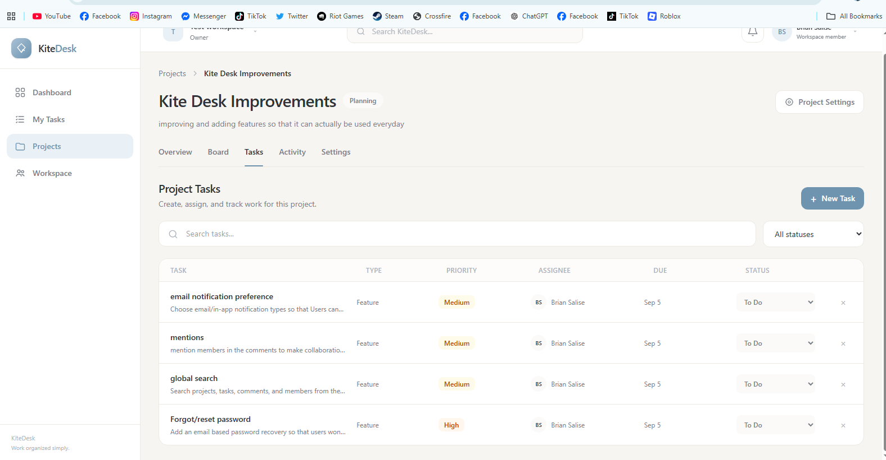
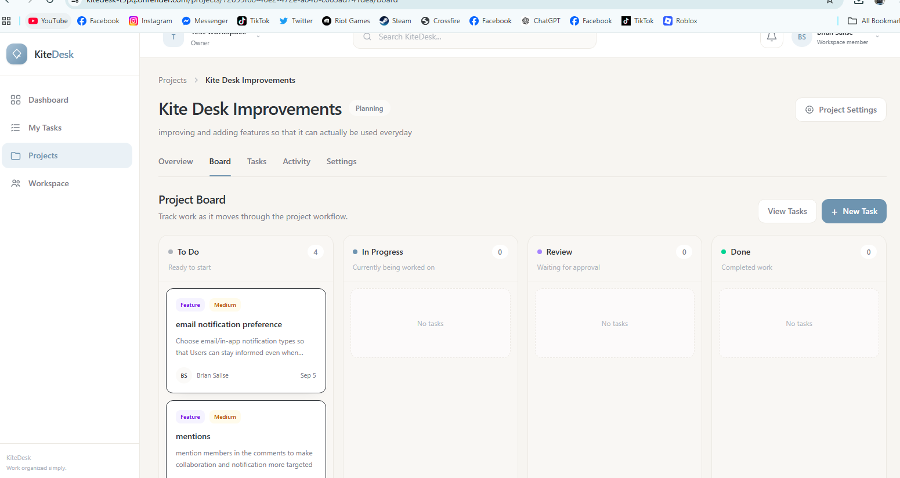

# KiteDesk

**KiteDesk** is a full-stack project management and issue-tracking application designed for small and growing software teams.

It was originally built as a personal full-stack project to support our capstone development workflow while also serving as a way to practice designing and developing a multi-user SaaS-style application with authentication, role-based permissions, project workflows, and relational database architecture.

KiteDesk brings workspace management, projects, tasks, team roles, comments, attachments, notifications, activity history, and review workflows into one centralized platform.

## Live Demo

**Live Application:**
https://kitedesk-t9pq.onrender.com

> KiteDesk is currently deployed on Render.

---

## Screenshots

### Dashboard

<!-- Add dashboard screenshot here -->





### Workspace / Projects

<!-- Add workspace or projects screenshot here -->





### Task Management

<!-- Add task details or task board screenshot here -->







---

## Project Goals

KiteDesk was developed to explore and practice real-world full-stack development concepts, including:

* Multi-user application architecture
* Secure authentication
* Role-based access control
* Relational database design
* REST API development
* Project and task workflows
* File handling
* Activity tracking
* CI/CD and deployment
* Responsive frontend development

---

## Features

### Authentication

* User registration
* User login
* Secure JWT authentication using HttpOnly cookies
* Logout
* Protected routes

### Workspaces

* Create and manage workspaces
* Workspace member management
* Owner, Manager, and Member roles
* Invite members through email
* Accept or decline workspace invitations
* Role-based workspace permissions

### Projects

* Create and manage projects
* Project status tracking
* Project deadlines
* Add and remove project members
* Project overview and progress tracking
* Project activity history

### Tasks

* Create and manage tasks
* Assign tasks to project members
* Task priorities
* Task types
* Due dates
* Task comments
* File attachments
* Task activity history

### Task Review Workflow

Tasks follow a structured review process:

```text
To Do
  ↓
In Progress
  ↓
Review
  ├──→ Approved → Done
  │
  └──→ Changes Requested
             ↓
        In Progress
```

This workflow allows completed work to be reviewed before it is marked as done while allowing reviewers to return tasks that require additional changes.

---

## Tech Stack

### Frontend

* React
* TypeScript
* Vite
* Tailwind CSS

### Backend

* Node.js
* Express.js
* REST API

### Database

* PostgreSQL
* Prisma ORM

### Authentication

* JSON Web Tokens (JWT)
* HttpOnly cookies

### Development & Deployment

* Git
* GitHub
* GitHub Actions
* Render

---

## Architecture

KiteDesk follows a client-server architecture.

```text
React + TypeScript Frontend
          ↓
       REST API
          ↓
Node.js + Express Backend
          ↓
      Prisma ORM
          ↓
      PostgreSQL
```

The frontend communicates with the Express backend through REST API endpoints. Prisma is used as the ORM for interacting with the PostgreSQL database.

Authentication is handled using JWTs stored in HttpOnly cookies.

---

## Roadmap

### Workspace Experience

- [x] Optional workspace creation during onboarding
- [x] Dashboard support for users without a workspace
- [x] Create multiple workspaces
- [x] Workspace switcher
- [x] Workspace management page
- [x] Remember last selected workspace

### Production & Reliability
- [x] Email verification for new accounts
- [x] Password recovery
- [x] Improved invitation authentication flow
- [x] Persistent cloud attachment storage
* [x] Unit and integration test foundation
* [x] End-to-end browser test foundation

### Productivity

* [x] Global search
* [x] Advanced task filtering
* [ ] Labels and tags
* [ ] Subtasks and checklists
* [ ] Project archiving

### Collaboration

* [ ] @mentions
* [ ] Task dependencies
* [ ] Email notifications
* [ ] Recurring tasks
* [ ] Project templates

### Future

* [ ] Real-time collaboration
* [ ] Project analytics
* [ ] Workload reporting
* [ ] Progressive Web App (PWA) support
* [ ] Two-factor authentication

---

## Current Status

KiteDesk is actively being developed.

The core functionality for authentication, workspaces, projects, task management, member roles, task review workflows, comments, attachments, and activity tracking has been implemented.

Additional improvements are planned for reliability, collaboration, testing, analytics, and productivity features.

---

## Running Locally

Clone the repository:

```bash
git clone https://github.com/brybryyyy12/KiteDesk.git
cd KiteDesk
```

Install the required dependencies for the frontend and backend according to the project structure:

```bash
cd server
npm install

cd client 
npm install
```

Configure the required environment variables before starting the application.

> Do not commit `.env` files, database credentials, JWT secrets, or other private configuration values to GitHub.

Generate the Prisma client if required:

```bash
run this on server

npx prisma generate
```

Run database migrations:

```bash
run this on server

npx prisma migrate dev
```

Start the development server:

```bash
run on both server and client

npm run dev
```

> The exact setup commands may differ depending on the frontend/backend folder structure. Update this section to match the repository's actual setup process.

---

## Future Development

KiteDesk will continue to evolve as I improve my knowledge of full-stack development, application architecture, testing, deployment, and modern software engineering practices.

The long-term goal is to make the application more reliable and suitable for real-world collaborative project management.

---

## Author

**Brian Salise**

BS Information Technology Student | Full-Stack Developer

* GitHub: https://github.com/brybryyyy12
* LinkedIn: https://www.linkedin.com/in/brian-salise-692115268/

---

## Feedback

KiteDesk is an ongoing learning and development project. Feedback, suggestions, and recommendations for improving the application or its architecture are welcome.
